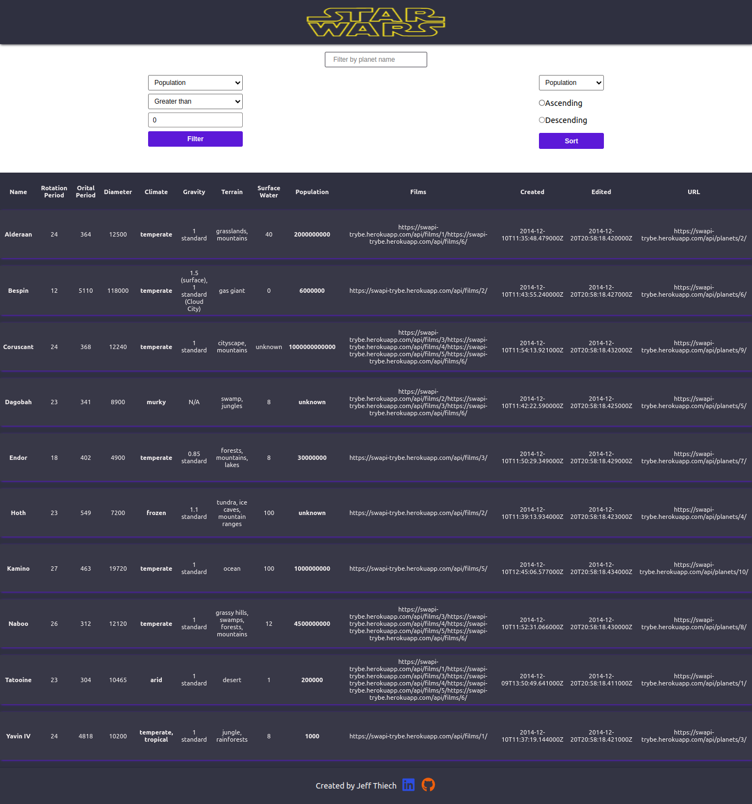
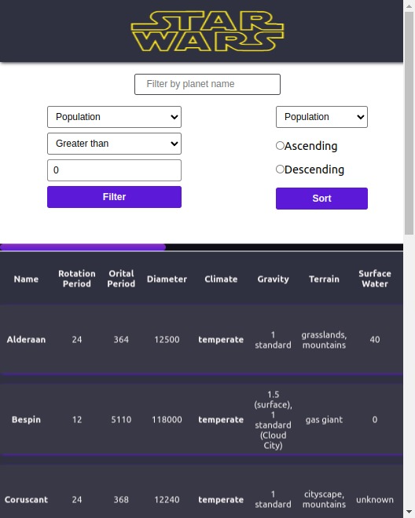

# StarWars Planets

The idea of this project is that using ReactJS and the Context API, we should create a site where it is possible to see information about the StarWars planets, apply various filters in order to find the information, and create a unique combination of filters.

# Technologies Used

For this project the following technologies were used:

- [JavaScript](https://developer.mozilla.org/pt-BR/docs/Web/JavaScript)
- [ReactJS](https://pt-br.reactjs.org/)
- [Context API](https://pt-br.reactjs.org/docs/context.html)
- [Docker](https://www.docker.com/)

 

## Home

 

## Mobile View

 

# How to Use:

1. Clone the repository

  ~~~bash
  git clone git@github.com:JeffThierch/StarWars-Planets.git
  ~~~

2. In the root of the project change the .env_example file to .env

3. (Optional) - Change the environment variables.

4. In the root of project run the commands:

  ~~~bash
  docker-compose up --build
  ~~~

5. If everything is configured correctly, after the build process you can simply access the application.
